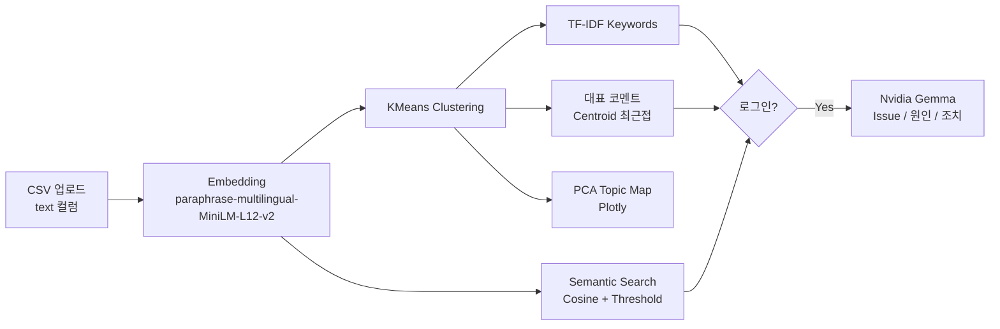

# 광주·전남 청년 속마음 지도 — AI Insight Engine

> 청년들의 이야기에서 진짜 인사이트를 찾다. 텍스트 한 번에, 속마음이 지도로 보인다.

[](https://ai-insight-engine-rvhaznxhkcqb9avcjmbt2k.streamlit.app/)
[](https://www.python.org/)
[](https://streamlit.io)
[](LICENSE)
[](https://huggingface.co/sentence-transformers/paraphrase-multilingual-MiniLM-L12-v2)

**Demo:** https://ai-insight-engine-rvhaznxhkcqb9avcjmbt2k.streamlit.app/  
**Repo:** `changsoo2609/ai-insight-engine`

---

## 📌 Overview

**AI Insight Engine**은 광주·전남 청년들의 자유로운 텍스트(상담, 설문, 인터뷰 등)를 
**임베딩 → 클러스터링 → 시각화 → 시맨틱 검색 → LLM 요약**까지 한 번에 분석하는 Streamlit 기반 인사이트 플랫폼입니다.

어렵고 딱딱한 데이터 분석이 아니라, **"청년들의 속마음이 지도 위에 펼쳐지는 경험"**을 목표로 만들었습니다. 전남 사투리/구어체 데이터도 자연스럽게 분석할 수 있도록 다국어 임베딩 모델을 사용합니다.

---

## ✨ Key Features

- **🗺️ Vivid Topic Map** - PCA 2차원 지도 위에 클러스터별 이야기를 시각화 (Plotly 인터랙티브)
- **🔍 Enter로 끝나는 Semantic Search** - 키워드 입력 후 `Enter` 한 번으로 유사 의견 즉시 탐색
- **🎚️ 유사도 Threshold** - 0.0~1.0 임계값 조절로 검색 정밀도 컨트롤
- **☁️ TF-IDF 키워드 & 대표 코멘트** - 클러스터별 핵심 키워드와 중심 최근접 대표 의견 자동 추출
- **🔒 로그인 후 LLM 요약** - Nvidia API Key 인증 후 Gemma 기반 **Issue / 원인 / 조치** 3단 요약
- **💬 Dialect Support** - `paraphrase-multilingual-MiniLM-L12-v2`로 표준어 + 전남 사투리/구어체 포용
- **🇰🇷 완전 한글 UI** - 업로드부터 결과까지 한글

---

## ⚙️ How it Works



| Step | 모듈 | 설명 |
|---|---|---|
| 1 | Embedding | `sentence-transformers` 384차원 벡터 변환 |
| 2 | KMeans | 유사한 속마음끼리 자동 군집화 (k=3~10) |
| 3 | TF-IDF | 클러스터별 특징 키워드 TOP 6 추출 |
| 4 | 대표 코멘트 | Centroid와 가장 가까운 실제 문장 |
| 5 | PCA Map | 2D 지도 시각화 (가까울수록 비슷한 얘기) |
| 6 | Semantic Search | 쿼리-전체 cosine 유사도 + threshold 필터 |
| 7 | LLM Summary | Nvidia NIM `google/gemma-2-9b-it` → `meta/llama-3.1-8b-instruct` 폴백 |

---

## 🚀 Quick Start

```bash
git clone https://github.com/changsoo2609/ai-insight-engine.git
cd ai-insight-engine
python -m venv venv
# Windows: venv\Scripts\activate
# macOS/Linux: source venv/bin/activate
pip install -r requirements.txt
streamlit run streamlit_app.py
```

`http://localhost:8501` 접속. 첫 실행 시 모델(약 400MB) 자동 다운로드.

---

## 📄 CSV Format

| text |
|---|
| 취업이 너무 막막해요 광주에 일자리가 없어요 |
| 전남에서 창업하고 싶은데 지원 정보가 없어요 |

- 인코딩 UTF-8 권장 (cp949 자동 감지)
- 빈 행/중복 자동 제거

---

## 📦 Sample Data

| 파일 | 설명 | Rows |
|---|---|---|
| `sample_jeonnam_dialect.csv` | 경량 데모 | 20 |
| `sample_jeonnam_dialect_full.csv` | 전체 | 420 |
| `sample_jeonnam_dialect_pair.csv` | dialect/standard 페어 | 420 |

`sample_jeonnam_dialect_full.csv`를 업로드하면 바로 체험 가능.

---

## ☁️ Deployment

1. `git push origin main`
2. https://share.streamlit.io → New app → `changsoo2609/ai-insight-engine` → `main` → `streamlit_app.py`
3. Secrets에 추가 (선택):
```toml
NVIDIA_API_KEY = "nvapi-..."
```
4. Deploy

---

## 🛠️ Tech Stack

Streamlit, sentence-transformers, scikit-learn, Plotly, OpenAI SDK + Nvidia NIM

---

## 📁 Project Structure

```
ai-insight-engine/
├── streamlit_app.py
├── requirements.txt
├── .streamlit/config.toml
├── sample_jeonnam_dialect*.csv
└── README.md
```

---

## 🔑 Secrets

`.streamlit/secrets.toml` (커밋 금지):
```toml
NVIDIA_API_KEY = "nvapi-..."
```
없으면 앱은 정상 동작하며 LLM 요약만 비활성화됩니다.

---

## ⚠️ Limitations

- k값 수동 지정, 경량 임베딩 모델 특성상 초장문/전문용어 정확도 한계, PCA 정보 손실, TF-IDF 통계 기반 한계, LLM API 의존

---

## 📜 License

MIT

---

<div align="center">

**⭐ 도움이 되었다면 Star를 눌러주세요!**

[Demo](https://ai-insight-engine-rvhaznxhkcqb9avcjmbt2k.streamlit.app/) · [Issues](https://github.com/changsoo2609/ai-insight-engine/issues)

</div>
